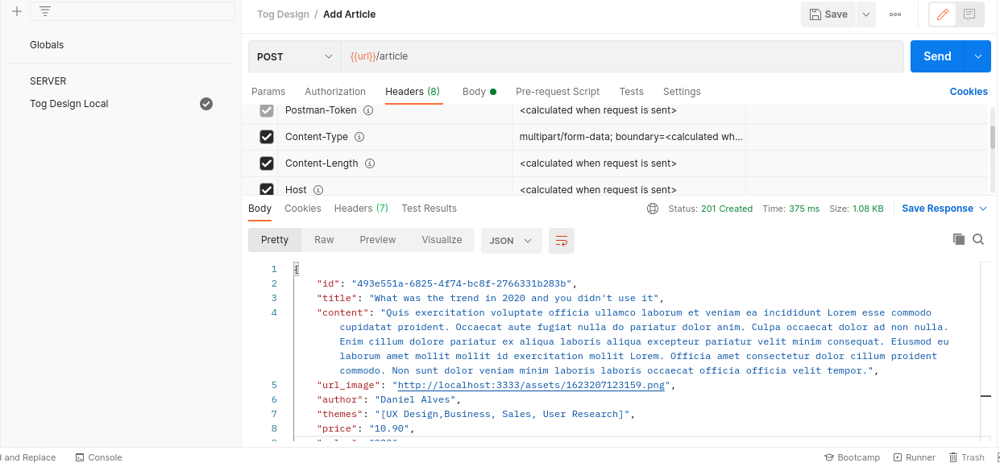
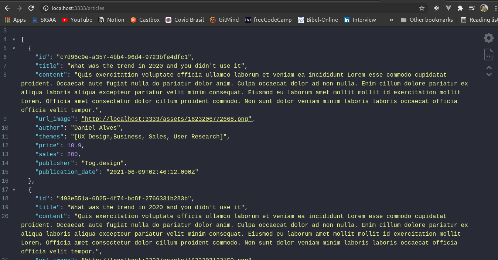
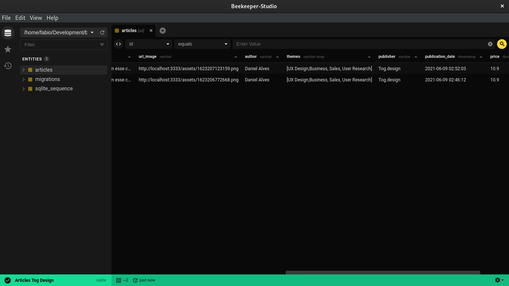

# Tog Design Test

## :thinking: What is that about?

This is a challenge (the backend part) project from [Tog Design](https://tog.design) developer team.

## 📷 Some screenshots
__Posting a article__
<p align="center">
 
</p>

__Getting all the articles__
<p align="center">
 
</p>

__Managing a SQL database__
<p align="center">
 
</p>


## ⭐ Objectives

- Get the challenge done.
- Implement a REST api.
- Get hired! (of course)

## 💻 Technologies

This repo is based in:

- [Node.js](https://nodejs.org/)
- [Express](https://expressjs.com/)
- [Typeorm](https://typeorm.io/)
- [Typescript](https://www.typescriptlang.org/)
- [SQLite](https://www.sqlite.org/)
- [Yarn](https://yarnpkg.com/)

## 📁 Other Libraries

- [uuid](https://www.npmjs.com/package/uuid)
- [ts-node-dev](https://www.npmjs.com/package/ts-node-dev)
- [reflect-metadata](https://www.npmjs.com/package/reflect-metadata)
- [multer](https://www.npmjs.com/package/multer)
- [cors](https://www.npmjs.com/package/cors)
- ... _More_

## 🚀 Getting Started

- Run the server:

```bash
# for npm users
npm install
# then 
npm run dev

# for yarn users
yarn
# then
yarn dev
```

- Open [http://localhost:3333](http://localhost:3333) with your browser to see the result.

Made with :heart: 👨🏻‍💻